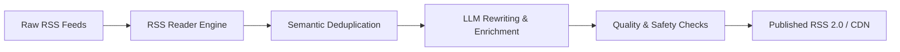

# Introduction to UglyFeed

**UglyFeed** is an open-source intelligence and news aggregation engine that leverages Large Language Models (LLMs) to retrieve, filter, evaluate, rewrite, and serve clean, enriched RSS feeds.

---

## Why UglyFeed?

Traditional RSS readers suffer from information overload:
- Multiple feeds cover the same breaking stories repeatedly.
- Articles are filled with clickbait headlines and low-signal summaries.
- Manual curation is time-consuming and difficult to automate.

**UglyFeed solves this** by inserting an AI intelligence layer between the raw RSS sources and your feed consumer:

---

## Key Highlights

1. **Multiple LLM Providers**:
   - **Google Gemini**: Full support including Gemini 2.0 Flash and Gemma 3 on free tier.
   - **OpenAI**: GPT-4o, GPT-4, and GPT-3.5 Turbo.
   - **Groq**: Ultra-fast Llama 3 8B/70B and Mixtral inference.
   - **Ollama**: 100% private local model execution on your own hardware.

2. **Semantic Similarity & Vectorization**:
   - Compares incoming articles against recently published items using vector embeddings.
   - Suppresses near-duplicate stories across completely different publishers.

3. **Autonomous Daily Delivery**:
   - Run daily workflows in GitHub Actions without managing servers.
   - Publish output XML to any target Git repository acting as a zero-cost CDN.

4. **Web UI & CLI**:
   - Full Streamlit graphical user interface for inspecting feeds, testing prompts, and configuring pipelines.
   - Script runner and CLI mode for headless server environments.

---

## Next Steps

- Proceed to the [Installation & Quickstart](/guide/installation) to launch UglyFeed.
- Read about [Docker & Docker Compose Deployment](/docker).
- Explore the [Google Gemini Setup](/free-gemini-setup) for zero-cost AI generation.
